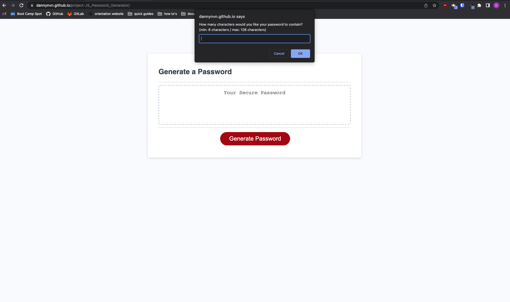

# JavaScript Password Generator

## Description
This is a password generator created from JavaScript, HTML, and CSS.
 
Link to deployed application: https://dannynvn.github.io/project-JS_Password_Generator/

## Usage
The application is initiated through the user's web browser. 
When the "Generate Password" button is clicked, user will be prompted with the following series of options for generating their password:
- The amount of characters to include in their password
- If lowercase alphabet characters should be included
- If uppercase alphabet characters should be included
- If numeric characters should be included
- If special characters should be included
 

User settings will be confirmed and password will be generated after all prompts are answered.

## Screenshot
